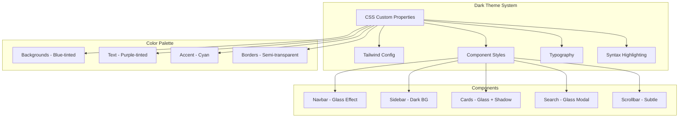

# Dark Theme Adaptation Plan

## Overview

This plan outlines the adaptation of the AMP-Main dark mode style to the Hugo blog (Hextra theme). The goal is to transform the current simple dark theme into a sophisticated, modern dark mode with glass morphism effects, refined color palette, and enhanced visual hierarchy.

## Current State Analysis

### Hugo Blog (Hextra Theme) - Current Dark Mode

The Hextra theme uses a basic dark mode implementation:

- **Background**: Simple `#111` (very dark gray)
- **Accent Color**: HSL-based primary color system (`hsl(204, 100%, 50%)` = blue)
- **Text Colors**: Slate-based palette (`slate-100`, `slate-900`)
- **No glass effects**: Solid backgrounds only
- **Basic shadows**: Minimal dark mode shadow support
- **Syntax highlighting**: GitHub dark style

**Key Files:**
- [`tailwind.config.js`](_vendor/github.com/imfing/hextra/tailwind.config.js) - Color definitions
- [`assets/css/styles.css`](_vendor/github.com/imfing/hextra/assets/css/styles.css) - Base styles
- [`assets/css/typography.css`](_vendor/github.com/imfing/hextra/assets/css/typography.css) - Typography styles
- [`assets/css/chroma/dark.css`](_vendor/github.com/imfing/hextra/assets/css/chroma/dark.css) - Syntax highlighting
- [`assets/css/components/*.css`](_vendor/github.com/imfing/hextra/assets/css/components/) - Component styles

### AMP-Main - Target Dark Mode Style

AMP-Main uses a sophisticated CSS custom property-based theming system:

```css
[data-theme="dark"] {
    --bg-primary: #0a0a0f;
    --bg-secondary: #12121a;
    --bg-tertiary: #1a1a28;
    --text-primary: #e8e8f0;
    --text-secondary: #8888a0;
    --accent: #4fc3f7;
    --accent-hover: #29b6f6;
    --accent-glow: rgba(79, 195, 247, 0.2);
    --border: rgba(255, 255, 255, 0.06);
    --header-bg: rgba(18, 18, 26, 0.8);
    --panel-bg: #12121a;
    --glass-bg: rgba(18, 18, 26, 0.6);
    --shadow-sm: 0 1px 3px rgba(0, 0, 0, 0.2);
    --shadow-md: 0 4px 16px rgba(0, 0, 0, 0.3);
    --shadow-lg: 0 12px 40px rgba(0, 0, 0, 0.5);
}
```

**Key Features:**
- Deep blue-tinted backgrounds
- Cyan accent color with glow effects
- Glass morphism (backdrop-filter blur)
- Semi-transparent overlays
- Custom shadows for dark mode
- Smooth transitions

## Implementation Plan

### Phase 1: CSS Custom Properties Foundation

Create a new CSS file with AMP-style custom properties that can override the Hextra defaults.

**File:** `assets/css/custom.css` (currently empty)

```css
:root {
  /* Light mode - keep existing */
}

.dark {
  /* AMP-style Dark Mode Colors */
  --bg-primary: #0a0a0f;
  --bg-secondary: #12121a;
  --bg-tertiary: #1a1a28;
  --text-primary: #e8e8f0;
  --text-secondary: #8888a0;
  
  /* Accent Colors */
  --accent: #4fc3f7;
  --accent-hover: #29b6f6;
  --accent-glow: rgba(79, 195, 247, 0.2);
  
  /* Border & Shadows */
  --border: rgba(255, 255, 255, 0.06);
  --shadow-sm: 0 1px 3px rgba(0, 0, 0, 0.2);
  --shadow-md: 0 4px 16px rgba(0, 0, 0, 0.3);
  --shadow-lg: 0 12px 40px rgba(0, 0, 0, 0.5);
  
  /* Glass Effects */
  --glass-bg: rgba(18, 18, 26, 0.6);
  --header-bg: rgba(18, 18, 26, 0.8);
  
  /* Override Hextra primary color */
  --primary-hue: 187deg;
  --primary-saturation: 90%;
  --primary-lightness: 57%;
}
```

### Phase 2: Tailwind Configuration Updates

Modify [`tailwind.config.js`](_vendor/github.com/imfing/hextra/tailwind.config.js:83) to extend the color palette:

```javascript
extend: {
  colors: {
    dark: '#0a0a0f',
    'dark-secondary': '#12121a',
    'dark-tertiary': '#1a1a28',
    accent: {
      DEFAULT: '#4fc3f7',
      hover: '#29b6f6',
      glow: 'rgba(79, 195, 247, 0.2)',
    }
  }
}
```

### Phase 3: Component Style Updates

#### 3.1 Navbar - Glass Morphism

Update [`assets/css/components/navbar.css`](_vendor/github.com/imfing/hextra/assets/css/components/navbar.css):

```css
.dark .nav-container-blur {
  background: var(--header-bg);
  backdrop-filter: blur(20px);
  -webkit-backdrop-filter: blur(20px);
  border-bottom: 1px solid var(--border);
}
```

#### 3.2 Sidebar - Dark Backgrounds

Update [`assets/css/components/sidebar.css`](_vendor/github.com/imfing/hextra/assets/css/components/sidebar.css):

```css
@media (max-width: 767px) {
  .dark .sidebar-container {
    background: var(--bg-secondary);
  }
}
```

#### 3.3 Cards - Glass Effect with Shadows

Add glass morphism to cards in dark mode with proper shadows.

#### 3.4 Search - Glass Modal

Update [`assets/css/components/search.css`](_vendor/github.com/imfing/hextra/assets/css/components/search.css) for glass effect.

### Phase 4: Typography Updates

Update [`assets/css/typography.css`](_vendor/github.com/imfing/hextra/assets/css/typography.css) with AMP-style text colors:

```css
.dark .content h1,
.dark .content h2,
.dark .content h3 {
  color: var(--text-primary);
}

.dark .content p {
  color: var(--text-secondary);
}

.dark .content a {
  color: var(--accent);
}

.dark .content a:hover {
  color: var(--accent-hover);
}
```

### Phase 5: Syntax Highlighting

Update [`assets/css/chroma/dark.css`](_vendor/github.com/imfing/hextra/assets/css/chroma/dark.css) with AMP-style colors:

- Background: `#0d1117` -> `#12121a`
- Adjust highlight colors to match cyan accent theme
- Update comment colors to `#8888a0`

### Phase 6: Scrollbar Styling

Update [`assets/css/components/scrollbar.css`](_vendor/github.com/imfing/hextra/assets/css/components/scrollbar.css):

```css
.dark ::-webkit-scrollbar-thumb {
  background: rgba(255, 255, 255, 0.12);
}
```

## File Modification Summary

| File | Changes |
|------|---------|
| `assets/css/custom.css` | Add CSS custom properties for dark mode |
| `tailwind.config.js` | Extend color palette with AMP colors |
| `assets/css/styles.css` | Update body and root styles |
| `assets/css/typography.css` | Update dark mode text colors |
| `assets/css/components/navbar.css` | Add glass morphism effect |
| `assets/css/components/sidebar.css` | Update dark backgrounds |
| `assets/css/components/cards.css` | Add glass effect and shadows |
| `assets/css/components/search.css` | Glass modal styling |
| `assets/css/components/scrollbar.css` | Dark mode scrollbar |
| `assets/css/chroma/dark.css` | Update syntax colors |

## Color Mapping Reference

| Element | Current (Hextra) | Target (AMP) |
|---------|------------------|--------------|
| Primary Background | `#111` | `#0a0a0f` |
| Secondary Background | - | `#12121a` |
| Tertiary Background | - | `#1a1a28` |
| Primary Text | `slate-100` | `#e8e8f0` |
| Secondary Text | `slate-400` | `#8888a0` |
| Accent Color | `hsl(204, 100%, 50%)` | `#4fc3f7` |
| Accent Hover | - | `#29b6f6` |
| Border | `white/10` | `rgba(255, 255, 255, 0.06)` |

## Visual Architecture



## Implementation Notes

1. **Preserve Light Mode**: All changes should only affect dark mode via `.dark` class selector
2. **CSS Specificity**: Use appropriate specificity to override Hextra defaults
3. **Tailwind Prefix**: Remember Hextra uses `hx-` prefix for Tailwind classes
4. **Build Process**: Changes to Tailwind config require rebuilding the compiled CSS
5. **Browser Support**: Include `-webkit-` prefixes for backdrop-filter

## Testing Checklist

- [ ] Dark mode toggle works correctly
- [ ] All pages render properly in dark mode
- [ ] Glass effects display correctly on supported browsers
- [ ] Syntax highlighting is readable
- [ ] Search modal has glass effect
- [ ] Sidebar has correct dark background
- [ ] Cards have proper shadows
- [ ] Links use accent color with hover state
- [ ] Scrollbar is subtle but visible
- [ ] No light mode regression